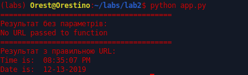

1. Сьворив папку для лабораторної та файл readme
2. Інсталював pipenv та створив ізольоване середовище.

3. Встановив requests та ntplib бібліотеки.
4. Створив файл app.py. Скопіював код з репозиторію.
5. 
6. Інсталював pytest.
7. Запустив тести:

8. Дописав функцію для друку привітання.
9. Написав тест для перевірки виконання функції:
10. Перенаправив результати у файл results.txt. Перенаправлення стандартних потоків у файл `cmd > file`, та допис у кінець файлу `cmd >> file`.
11. Зробив коміт.
12. Заповнив Makefile
13. Закомітив зміни.