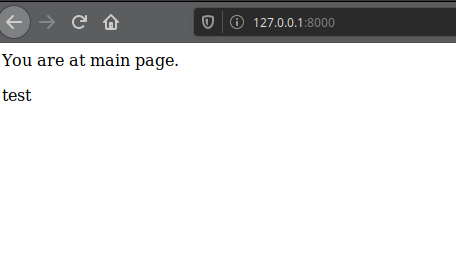

1. Виконав команди та перенаправив вивід у файл:
``` Bash
docker -v > my_work.log
docker -h >> my_work.log
docker run docker/whalesay cowsay Docker is fun >> my_work.log
```
2. Завантажив базовий імедж. Створив Dockerfile. Замінив посилання.
3. Створив репозиторій на docker hub:

4. Виконав білд та завантажив імедж на хаб:

- Посилання на репозиторій: https://hub.docker.com/r/orchivald/kk4
5. Запустив веб-сайт:


6. Завдання: Створив ще один докер файл для програми моніторингу. Зробив білд. Запустив два контейнери одночасно. Дістав логи з контейнера:

