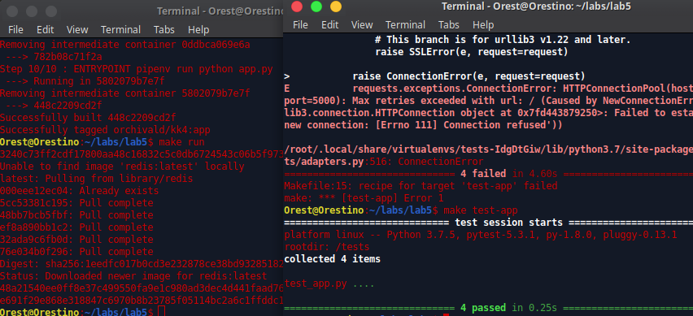

1. Створив папку з лабораторною. В ній створив папки `tests`, `my_app`. Скопіював файли з репозиторію. Файл requirements.txt містить наступні залежності: my_app: redis, flask; tests: requests, pytest
2. Запустив проект:

- як можна побачити не всі тести пройшли успішно. Причина у відсутній папці `logs`:

3. Видалив файли що були створені у результаті запуску проекту. Створив два Dockerfile з репозиторію та один makefile.
4. Ознайомився з вмістом фалів. Директиви Makefile:
- STATES - змінна містить назви цілей
- REPO - назва репозиторію
- .PHONY - вказуємо що цілі не є файлами
- $(STATES): - визначаємо порядок дій для цілей app та tests. (створюємо імеджі)
- run - запускаємо імеджі redis-сервера та сервера з додатком. Також створюємо мережу
- test-app - запускаємо імедж з тестами
- docker-prune - очищуємо всі створені докером файли
5. Змінив теги. Створив імеджі за допомогою make. Запустив сервер та тести. Скріни сторінок:

6. Почистив ресурси.
7. Створив директиву для завантаження імеджів. Завантажив.
8. Видалив вже існуючі імеджі. Створив директиву.
9. Створив docker-compose файл заповний вмістом. Мережі потрібні для відокремлення контейнерів. Одна мережа типу секретна для комунікації між сервером і сховищем даних, а інша публічна - для доступу інших контейнерів чи типу того.
10. Запустив compose.
11. Зайти потрібно на адресу localhost (127.0.0.1).
12. Теги імеджів з вашим репозиторієм. Змінив на свої та запустив компоуз.
13. Зупинив. Почистив ресурси.
14. Заантажив імеджі до репозиторію.
15. На мою думку все залежить від ситуації для якої нам необхідна автоматизація. Я читав думки інших студентів, що здавали лаби. Побачив різні варіанти, однак схиляюся більше до дуального, по ситуації: для розгортання проектів лише для docker-контейнерів можна цілком обійтися docker-compose (моя думка, вона засновується на власних домислах), для всіх інших ситуацій краще використовувати Makefile.
16. Створив docker-compose.yml для лабораторної #4.